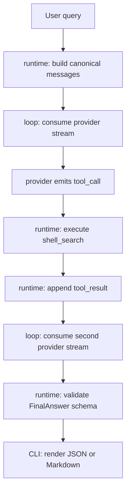

最近我尝试用 Codex 做一个 research agent 的 MVP。目标并非直接做一个完整产品，我更关心在相对复杂的工程场景里，怎么设计才更容易得到可验证、可迭代、边界清楚的代码。

这个 agent 的目标是：用户输入一个 research query，agent 能进行本地搜索，读取搜索结果，再输出结构化答案。后续希望支持多 provider、工具调用、可中断恢复、结果追溯、上下文压缩、session event log、branch history、debug timeline 等能力。但第一版只要求跑通最小可运行路径。

我一共用了三组提示词和三个 Codex 任务来做这个实验。它们不算严格意义上的同题平行对比，更像一次连续修正：从宽泛架构设计，到要求先做 MVP，再到隔离工作树里从空目录开始实现。这个过程里最有价值的地方，在于提示词边界的变化如何影响代码质量。

## 第一次：架构提示词太宽，计划很完整，但容易拖慢实现

第一次给 Codex 的提示词大致是这样：

```md
设计一个能够自主搜索、分析并输出结果的 research agent。
支持多 provider、工具调用、上下文可中断恢复、结果追溯，并且在时间、步数、预算约束下稳定结束。

agent 分为以下层级：
1. 消息抽象层：负责把不同 provider 的消息格式转化为统一格式
2. loop 层：单轮执行器，只流式处理消息，判断每轮节点 final / tool call / stop / retry
3. agent runtime 层：维护 agent 实例，组织 prompt，管理上下文窗口，处理上下文压缩，执行工具，维护 follow-up / steering 队列和 _state
4. session 层：负责读取 cwd / agent 的 setting.json 和 prompt，持久化事件流，支持 resume、branch、debug timeline

运行过程：
先做意图分析，使用 shell 本地搜索，然后继续分析，输出 structured final answer。
可以不止搜索一次，在 plan-act-observe-reflect loop 中逐步缩小问题空间。

停止策略：
达到任务目标 / 达到 maxSteps / 外部策略要求停止 / 用户中断 / 连续几轮没有新的信息增益。

错误处理：
provider timeout、tool timeout、context overflow、provider capability mismatch。

根据上述内容制定 plan，包含详细任务阶段、测试模块、端到端测试和可观测验收标准。
每个阶段代码量不可过大，并且要有严格的 docs 描述架构设计、任务面板、代码和提交规范。
```

这个提示词的优点是信息充足。它把分层、错误、停止策略、session、context compaction、branch tree 都说清楚了，所以 Codex 产出的设计文档方向基本正确。问题是它的范围太大，模型很自然地会输出一份覆盖长期目标的长计划，当前可运行功能的优先级反而不够高。第一次输出里架构意识是有的，但离“马上写一个可验证 MVP”还有距离。

这次的代码落在 `E:\GitClone\agent`，分支是 `feature/research-agent-mvp`。后续它确实演进出了一套可运行代码：有 canonical message、fake provider、Ollama provider、loop、runtime、shell_search、CLI、单元测试、集成测试和 E2E 测试。验证结果是：

```text
30 passed, 1 skipped
ruff: All checks passed
```

但我用真实命令验证时发现一个问题。默认 fake provider 在下面这个场景里会给出错误自信：

```powershell
uv run research-agent run `
  --query "what is about E:\GitClone\zlib-to-notebooklm" `
  --cwd tests/fixtures/repo `
  --max-steps 3 `
  --format json
```

实际输出仍然回答了 fixture repo 的 `config_loader`，即使搜索结果没有命中，confidence 还是 `high`。这说明测试绿并不代表行为可靠。这里的问题不在语法或工程结构，而在默认 deterministic provider 固定复用了原来的 fixture 答案，测试没有覆盖“无证据时不能继续给旧结论”的行为。

第一次提示词的表现可以概括为：适合建立设计框架，不适合作为直接实现 MVP 的入口。它需要再加“当前阶段只允许做哪些事情、哪些能力只写文档、实现后必须跑哪些用户级命令”。

## 第二次：加入 MVP 约束，行为更保守，但能力还不完整

第二次我追加了更明确的要求：

```md
先做一个最小 MVP。
MVP 路径是：
统一 message schema、接一个 provider adapter、单轮 loop、一个工具执行器、最终输出 JSON / Markdown。

成功标准：
用户给一个 research query，agent 能搜索一次，读取结果，再回答一次。

优先实现 MVP，同时保留完整设计。
长计划不要完全删除，把完整设计压缩成 architecture / roadmap 文档。
MVP plan 只保留当前要开发的任务项。
```

这个提示词比第一次更有效，因为它把“完整架构”和“当前实现”分开了。完整设计可以保留在 `docs/architecture` 或 roadmap 里，但当前代码只服务于 MVP。这样模型不容易一边写 session、branch、resume，一边又写 provider，导致每个模块都只有半成品。

第二次实现落在 `E:\GitClone\agent-worktrees\isolated-worktree`。这个版本后来经过手动验证，修了几个很实际的问题：

- fake provider 不再固定搜索 `setting.json|config_loader`
- 搜索无命中时不会继续输出 `config_loader` 结论
- Windows 路径中的盘符冒号不会把 `E:\...` 解析成 source `E`
- `rg` 输出固定使用 UTF-8 解码，避免中文或 emoji 让 Windows 控制台读取失败

验证结果也是：

```text
30 passed, 1 skipped
ruff: All checks passed
```

这个版本的行为比第一次保守。对 `what is about E:\GitClone\zlib-to-notebooklm` 这类 query，它返回低置信度和无证据说明，没有继续输出 fixture 的结论。这比错误自信更可接受。

但它还有一个能力缺口：query 里出现的 `E:\GitClone\zlib-to-notebooklm` 没有被当作实际搜索目录。也就是说，它仍然只在 `--cwd` 指定的目录里查。用户把路径写进 query，本意通常是“去这个目录分析项目”，但这版只把路径拆成搜索词。这个行为不算错到离谱，但不符合直觉。

第二次提示词的表现可以概括为：MVP 边界明显更好，测试也更贴近真实错误；但提示词里还应该明确“用户输入中的本地路径如何处理”，否则模型会把路径当普通文本。

## 第三次：空工作树从零开始，架构更干净，但搜索工具太弱

第三次我要求新建一个完全隔离的空 worktree，不能看到原项目文件。

使用提示词
```md
实现一个research agent，从mvp开始，以可扩展到生产级为目标
目标：
设计一个能够自主搜索、分析并输出结构化结果的research agent。
要求后续支持扩展到
-多provider -工具调用 -上下文可中断恢复 -结果可追溯 
已确定的架构分层：
1. 消息抽象层：把不同 provider 的消息格式转成统一格式
2. loop 层：单轮执行器，只处理流式消息和轮次结束判定
3. agent runtime 层：组织 prompt、管理上下文窗口、上下文压缩、tool execution、follow-up/steering 队列、_state
4. session 层：负责 settings/prompt 装配、事件流持久化、resume、branch 管理、debug timeline
实现原则：
-先做mvp，再逐层增强
-所有涉及要保证可扩展，但是当前phase不要过度实现未来需求
-先出plan，再写代码
-每次只实现一个phase，代码改动可控
mvp要求：
跑通最小 research 闭环：
用户输入 -> 意图分析 -> shell 本地搜索 -> 观察结果 -> 再次分析 -> 输出 structured final answer
-有统一消息结构
-接入ollama povider
-单轮loop
-一个tool executor（shell）
-structured final answer输出
---
工作方式：
1.先根据上述目标输出一个分阶段 impl plan
2.每个阶段包含：
-目标
-范围
-涉及模块和文件
-核心接口
-单元测试/集成测试/端到端测试
-验收标准
-风险点
3.计划严格控制每阶段提交代码量
4，输出计划后暂停，等我确认
5.每次实现只处理一个阶段，且先给出阶段计划
6.所有代码遵循模块边界清晰、可测试、低耦合、可读的原则
额外要求：
- 上下文压缩必须保证 tool_call 和 tool_result 成对保留
- session 持久化采用 append-only event log 思路
- branch 由 id/pid 树结构表达
- 停止策略至少包括：任务完成、maxSteps、外部策略、用户中断、连续几轮无新增信息增益
- 错误处理至少考虑：provider/tool timeout、context overflow、provider capability mismatch
输出计划和实施文档，AGENT.md存当前设计任务的规则性内容
```
然后
```md
创建文档，然后
基于已确认的 phase 1 计划，先不要实现业务代码。
先编写测试与测试夹具，覆盖以下行为：

1. 用户输入 research query 后，runtime 能进入 loop
2. shell search 工具被调用后，tool result 能回注到消息流
3. loop 能在 final / tool_call / maxSteps 三种分支中正确结束
4. structured final answer 满足既定 schema
5. 当 provider/tool timeout 时，系统给出可预期错误，避免卡死

要求：
- 先写单元测试和最小集成测试
- 测试命名要清晰
- 每个测试附一句意图说明
- 如果需要 mock provider 或 mock tool，请明确 mock 边界
- 输出新增测试文件列表和覆盖的行为矩阵

不要实现业务代码，先只生成测试代码和必要的 mock/stub。
```
这个版本是从空 orphan branch 开始的，状态是：

```text
No commits yet on codex/isolated-empty-20260801
```

它的实现和前两个不太一样。前两个 provider 更像 `complete(messages, tools) -> message` 的调用方式，第三版用了 streaming event 的抽象：

```python
async for raw_event in self.provider.stream(messages):
    event_type = event.get("type")
    if event_type == "text_delta":
        text_parts.append(str(event.get("text", "")))
    elif event_type == "tool_call":
        tool_calls.append(...)
    elif event_type == "done":
        done_reason = event.get("reason")
```

这个方向更接近最初设计里的 loop 层：loop 只处理 provider stream，判断这一轮是 final、tool_call、retry 还是 stop，不负责执行工具。runtime 负责组织 messages、执行 tool、把 tool_result 回传给下一轮。这个分层比前两个更干净。

第三版的验证结果是：

```text
16 passed
compileall: passed
```

它还修了一个很关键的 provider 体验问题：`--provider ollama` 默认模型从写死的 `llama3.1` 改成了 `auto`，会读 `/api/tags` 选择本机已安装模型。Ollama HTTP 失败时，CLI 会输出简短错误，不打印 Python traceback。例如本机模型启动失败时，会输出类似：

```text
research-agent error: Ollama /api/chat returned HTTP 500: ...
```

这点比前两个更像一个真正 CLI 工具应该有的行为。

不过第三版的 `shell_search` 相对弱。它没有固定 UTF-8 解码，也不会识别 query 中的本地目录。更重要的是，搜索无结果时仍然把 `No matches found.` 当作 evidence，并且 confidence 还是 `high`：

```json
{
  "answer": "The local search did not find enough evidence to answer confidently.",
  "evidence": [
    {
      "source": "shell_search",
      "snippet": "No matches found."
    }
  ],
  "confidence": "high"
}
```

这在结构上通过了 schema，但在语义上不合理。没有证据时应该是空 evidence，confidence 应该降低，limitations 应该说明搜索范围和查询策略的限制。

第三次提示词的表现可以概括为：隔离环境和架构边界最好，Ollama 错误处理也更成熟；但工具结果建模和无证据语义没有要求清楚，所以模型只保证了“能输出 schema”，没有保证“schema 的内容可信”。

## 架构层面的重点

这三版实现都围绕同一个四层设计展开，但真正决定质量的是每层有没有清楚的职责边界，目录名是否看起来完整反而次要。对这个 MVP 来说，比较合理的数据流应该是：



这个流程里，`loop` 的职责应该很窄：它只看 provider event，把一轮输出归类成 `final`、`tool_call`、`retry` 或 `stop`。它不应该知道 `shell_search` 是什么，也不应该直接读写文件。第三版的 `stream()` event 接口更接近这个方向：

```python
async for raw_event in self.provider.stream(messages):
    event_type = event.get("type")
    if event_type == "text_delta":
        text_parts.append(str(event.get("text", "")))
    elif event_type == "tool_call":
        tool_calls.append(...)
    elif event_type == "done":
        done_reason = event.get("reason")
```

第一、二版的 `complete(messages, tools) -> CanonicalMessage` 更容易实现 MVP，但它把 provider 调用抽象成“一次完整回答”。等后续要支持流式输出、partial tool call、provider retry、usage event、debug timeline 时，这个接口会变得吃力。`stream()` 抽象虽然代码稍微多一点，但更适合后续演进。

我认为每层比较清楚的契约应该是这样：

| 层 | 应该负责 | 不应该负责 |
| --- | --- | --- |
| `messages` | 定义 provider-neutral schema，处理 provider adapter 的格式转换 | 执行工具、决定停止策略、读取 session |
| `loop` | 消费 provider stream，聚合 event，返回 `final/tool_call/retry/stop` | 解析业务 query、调用 `shell_search`、写 event log |
| `runtime` | 组织 prompt，维护本次运行 state，调用 loop，执行 tool，校验 final answer | 处理 provider 私有消息格式、持久化长期历史 |
| `session` | 后续处理 settings/prompt 装配、append-only event log、resume、branch、debug timeline | 参与单轮模型输出分类、直接执行工具 |

这里尤其要注意 `session`。三次实验里都提到了 session、resume、branch 和 context compaction，但 MVP 代码并没有真正实现这些能力。它们应该进入 architecture roadmap 和测试计划，不应该混进第一版代码。否则很容易出现一批只有名字、没有行为保证的模块。

## 关键约束要进入测试

agent 架构的质量不能只看“有没有分层”，还要看关键约束有没有被测试保护。这个实验里暴露出的几个问题都和约束缺失有关。

第一，`tool_call` 和 `tool_result` 必须成对。后续做 context compaction 时，不能保留 tool_result 却移走对应 tool_call，也不能保留 tool_call 却丢掉 tool_result。这个约束应该写进 message/context 测试，不能只停留在文档里。

第二，`final answer` 的 schema 校验只能保证形状，不能保证语义。第三版把 `No matches found.` 放进 evidence，并且 confidence 还是 `high`，这就是典型例子。合理规则应该是：没有真实 hits 时，`evidence` 为空，`confidence` 为 `low`，`limitations` 说明搜索范围或 query 策略限制。

第三，工具错误不能伪装成证据。`rg` 解码失败、cwd 不存在、provider timeout、tool timeout 都应该进入 error 或 limitations，不能进入 evidence。evidence 只能来自真实搜索命中的文件内容或文件预览。

第四，query 中的本地路径必须有明确语义。用户输入 `what is about E:\GitClone\zlib-to-notebooklm` 时，存在的目录应该优先成为 research cwd。否则 agent 输出看起来像分析了目标项目，实际读的是默认 `--cwd`。

第五，Windows 运行环境要当成一等约束。这个项目的真实验证都在 Windows 上，`E:` 盘符、反斜杠路径、GBK 控制台、UTF-8 文件内容、emoji 输出都会影响行为。`rg` 调用和 CLI 输出层需要固定编码策略，路径解析也要专门测试。

这些约束最好变成测试名，避免只写成自然语言。例如：

```text
test_runtime_preserves_tool_call_result_pairs_after_compaction
test_final_answer_has_low_confidence_when_search_returns_no_hits
test_tool_errors_do_not_become_evidence
test_query_existing_windows_path_becomes_research_cwd
test_rg_output_uses_utf8_with_replacement
test_rg_line_parser_handles_windows_drive_colon
```

## 三版实现的架构对比

把代码结构和行为放在一起看，三版的取舍更清楚：

| 版本 | Provider 接口 | Tool result | 路径 query 处理 | 无证据行为 | 后续扩展基础 |
| --- | --- | --- | --- | --- | --- |
| `E:\GitClone\agent` 主目录版 | `complete()` | JSON 较完整，含 hits/error/truncated | 已尝试识别 query 中的本地目录 | 仍可能复用旧结论，confidence 为 `high` | 功能最多，但要先修 evidence 语义 |
| `E:\GitClone\agent-worktrees\isolated-worktree` | `complete()` | JSON 较完整 | 只把路径拆成搜索词，不改变 research cwd | 无命中时低置信度，比主目录版可信 | 适合作为 QA 后修正版参考 |
| C 盘 orphan worktree | `stream()` | 字符串，结构偏弱 | 不识别 query 中的本地目录 | `No matches found.` 会进入 evidence，confidence 偏高 | 分层最好，适合作为 runtime 骨架 |

所以如果要继续做下去，我会以第三版的 `stream()` loop 作为骨架，合并第一、二版里更成熟的 `shell_search` 结构化结果、Windows 编码处理、路径 query 处理和无证据测试。这样可以同时保留干净的架构和更可信的用户级行为。

## 三次提示词的实际差异

把三次放在一起看，差异很明显。

第一次的提示词像一份完整系统需求。它能让模型写出长期架构，但容易让 MVP 变成“看起来什么都考虑了，实际边界不够紧”的工程。代码能跑，测试也绿，但 deterministic provider 固定答案的问题说明它没有把“证据约束”当作核心验收。

第二次的提示词强调了 MVP 和文档分层，效果明显更好。它让模型开始围绕真实失败修测试，尤其是 no evidence、Windows path、UTF-8 这些具体问题。但它仍然没有规定 query 中本地路径的语义，所以路径只被当成搜索词。

第三次的提示词加了隔离工作树，从空目录开始做，工程边界反而更干净。它最像一个真正 research agent runtime 的骨架：streaming provider、loop executor、runtime、tool executor 分工明确。缺点是功能更薄，搜索工具和 evidence 语义还需要进一步加强。

如果只按“最适合作为后续生产级演进的基础”来选，我会选第三版。它的 loop/provider/runtime 分层更贴近目标。然后把第一版和第二版里已经暴露出的 Windows、路径、无证据、文件名命中、CLI 编码等经验合并进去。

如果只按“当前用户命令能覆盖多少场景”来选，第一版功能最多，但必须先修 fake provider 错误自信的问题。

如果只按“回答是否保守可信”来选，第二版比第一版更好，因为无命中时不会继续复用旧答案。

## 代码是否合理

从 MVP 角度看，三版都已经做到了“可以运行、可以测试、可以从 CLI 看结果”。这已经比只写文档强很多。但如果按 agent runtime 的长期目标看，还有几个必须修的点。

第一，provider 抽象要统一。第一、二版是 `complete()` 风格，第三版是 `stream()` 风格。考虑到原始目标明确提到 loop 层要处理流式消息，第三版的接口更合适。后续应该统一成 streaming provider，并把 fake provider、Ollama provider 都放到同一个事件协议上。

第二，tool result 不能只是一段字符串。第三版的 `shell_search` 返回字符串，第一、二版已经开始把结果建成 JSON。长期看应该使用结构化结果，例如：

```json
{
  "query": "README|pyproject.toml",
  "cwd": "E:\\GitClone\\zlib-to-notebooklm",
  "hits": [
    {
      "source": "README.md",
      "line": 1,
      "snippet": "..."
    }
  ],
  "truncated": false,
  "error": null
}
```

这样 final answer 才能可靠地区分“有证据”“没有证据”“工具出错”“搜索结果被截断”。

第三，confidence 必须由证据状态约束。没有 hits 时，confidence 不应该是 `high`；工具出错时，也不应该把错误文本放进 evidence。这个规则不该交给模型自由判断，应该在 runtime 或 final answer validator 里做基本检查。

第四，query 中的本地路径需要明确语义。如果用户问 `what is about E:\GitClone\zlib-to-notebooklm`，agent 应该优先把这个 existing directory 作为 research cwd，不能只把 `zlib-to-notebooklm` 当作关键词。否则用户会以为 agent 读了目标项目，实际它只读了默认 `--cwd`。

第五，Windows 是这个项目的真实运行环境，编码和路径不能当成细节。`rg` 输出要固定 `encoding="utf-8", errors="replace"`，Windows drive path 的 `E:` 不能破坏 `path:line:snippet` 解析，CLI stdout/stderr 也要能输出 UTF-8。

## 这个场景下更好的提示词写法

经过这三次，我认为这个场景下最有效的提示词应该分成两段：第一段是长期架构约束，第二段是当前阶段任务。长期架构只规定方向，不允许模型一次性实现；当前阶段任务必须给文件范围、行为验收、测试命令和停止条件。

下面是我认为更适合这个场景的提示词：

```md
你要在一个新的 Python/uv 项目里实现 research agent。

长期目标：
- 支持多 provider
- 支持工具调用
- 支持可中断恢复和 append-only session event log
- 支持结果追溯
- 支持上下文压缩，并保证 tool_call 和 tool_result 成对保留
- 支持 branch id/pid 树、debug timeline、resume
- 支持停止策略：completed、max_steps、external_policy、user_interrupted、no_information_gain
- 支持错误类型：provider timeout、tool timeout、context overflow、provider capability mismatch、malformed provider response

架构分层必须保持：
1. messages：只定义 provider-neutral message schema，以及 provider adapter 的格式转换。
2. loop：只执行一轮 provider stream，聚合事件，返回 final/tool_call/retry/stop，不执行工具。
3. runtime：组织 prompt、维护本次运行 state、调用 loop、执行 tool、把 tool_result 回传、生成 final answer。
4. session：后续负责 settings/prompt 装配、append-only event log、resume、branch、debug timeline。本阶段只写文档，不实现 session。

当前只实现 MVP，不实现完整长期目标。

MVP 行为：
用户输入 research query -> provider 首轮发起一次 shell_search -> runtime 执行本地搜索 -> 把 tool_result 回传 provider -> provider 第二轮输出 structured final answer -> CLI 输出 JSON 或 Markdown。

当前阶段允许创建或修改：
- pyproject.toml
- src/research_agent/messages/*
- src/research_agent/messages/adapters/*
- src/research_agent/loop/*
- src/research_agent/runtime/*
- src/research_agent/tools/shell_search.py
- src/research_agent/providers/*
- src/research_agent/cli.py
- tests/unit/*
- tests/integration/*
- tests/e2e/*
- docs/plans/*
- docs/architecture/*
- AGENTS.md

当前阶段不要实现：
- session event log
- resume
- branch tree
- context compaction
- 多 provider registry
- token/cost budget
- UI timeline

Provider 要求：
- 默认 provider 必须是 deterministic local provider，测试和本地 CLI 不依赖网络。
- Ollama provider 可以实现，但 live test 必须默认 skip，需要显式环境变量才运行。
- provider 接口采用 streaming event：
  - text_delta
  - tool_call
  - done
  - error
- loop 只消费这些 event，不知道 shell_search 的存在。

shell_search 要求：
- 优先使用 rg。
- 不允许执行任意 shell command，只允许本地搜索。
- query 里的 existing local directory 应优先作为 research cwd。
- 支持 Windows path，例如 E:\GitClone\repo。
- rg 输出使用 UTF-8 解码，并设置 errors="replace"。
- rg 的 path:line:snippet 解析必须正确处理 Windows drive colon。
- 返回结构化结果：query、cwd、hits、exit_code、truncated、error。
- hits 为空时，final answer 的 evidence 必须为空，confidence 不能是 high。

Final answer schema：
{
  "answer": "string",
  "evidence": [
    {"source": "string", "snippet": "string"}
  ],
  "limitations": ["string"],
  "confidence": "low|medium|high"
}

证据规则：
- 只有真实搜索命中的文件内容或文件预览可以进入 evidence。
- "No matches found"、工具错误、空结果不能作为 evidence。
- 没有 evidence 时，answer 必须说明无法从本地证据回答，confidence 必须是 low。
- final answer 必须能被 Pydantic 校验。

测试要求：
先写或更新测试，再实现。
必须覆盖：
1. canonical message schema 校验
2. loop final/tool_call/retry/stop 分类
3. runtime 执行一次 shell_search 并把 tool_result 回传
4. CLI markdown 输出
5. CLI JSON 输出
6. no evidence 时不输出旧结论，confidence 为 low
7. query 中存在 Windows 本地目录时，使用该目录作为 research cwd
8. rg 输出含 Windows drive path 时 source 解析正确
9. rg 输出含中文或 emoji 时不因编码失败中断
10. Ollama HTTP/provider 错误在 CLI 中显示简短错误，不打印 traceback

验收命令：
uv run pytest -q
uv run ruff check .
uv run python -m compileall -q src tests
uv run research-agent run --query "Where is the project configuration loaded?" --cwd tests/fixtures/repo --max-steps 3 --format json
uv run research-agent run --query "what is about E:\GitClone\zlib-to-notebooklm" --cwd tests/fixtures/repo --max-steps 3 --format json

验收标准：
- 所有测试通过。
- ruff 通过。
- compileall 通过。
- 第一条 CLI 命令返回真实 fixture 证据。
- 第二条 CLI 命令必须搜索 query 中的 E:\GitClone\zlib-to-notebooklm；如果目录存在但没有命中，不能输出 fixture repo 的旧结论。
- 没有 evidence 时 confidence 不能是 high。

工作方式：
1. 先输出阶段计划，说明本阶段只实现 MVP。
2. 等确认后再写代码。
3. 实现时每次只处理一个行为。
4. 每个行为都要有对应测试。
5. 结束时报告改动文件、验证命令和真实 CLI 输出摘要。
```

这个提示词的关键不在长度，而在于把模型容易误解的地方写成验收规则。比如“输出 JSON schema”不够，必须说清楚没有证据时 evidence 怎么办；“支持 shell_search”不够，必须说清楚本地路径、Windows 编码和 `rg` 输出解析；“先做 MVP”也不够，必须明确哪些长期能力只进文档，不进入当前代码。

## 我从这次实验得到的判断

在 agent 这种任务里，提示词最容易犯的错误是把长期愿景和当前阶段混在一起。模型会很努力地满足所有要求，但代码会变成“每个未来能力都出现一点”，测试却只能覆盖最顺利的一条路径。

更好的写法是：先给长期架构，让模型知道边界；再给当前阶段，让模型知道今天只实现什么；最后给验收命令，让模型必须面对真实运行结果。尤其要写清楚反例：无证据不能自信回答，路径 query 不能只当普通文本，工具错误不能伪装成 evidence。

这次三版实现里，我更愿意以第三版的 streaming loop 架构为基础，再吸收第一、二版暴露出来的真实 Windows 和 evidence 问题。对一个 research agent 来说，能回答很重要，但更重要的是知道自己有没有证据。
